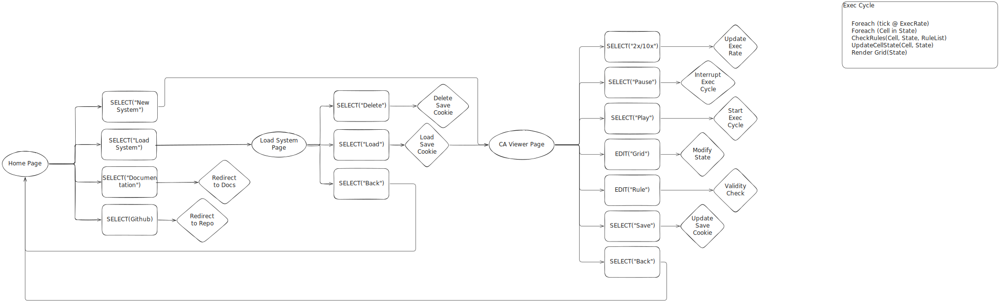
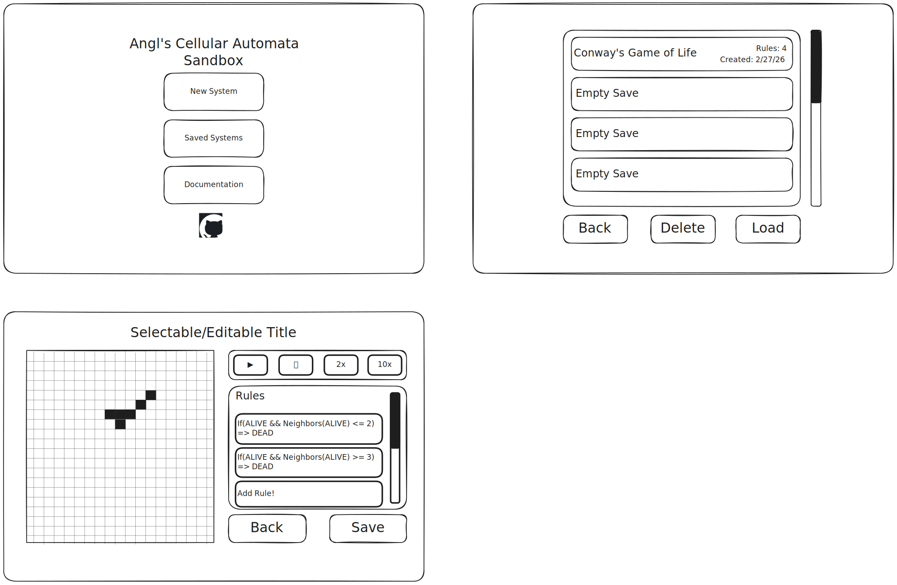

<h1 align="center"> Java - Cellular Automaton Sandbox </h1>

---

    

This project is a sandbox environment for exploring 2-dimensional cellular automata with configurable update rulesets and initial state. This project is an exploration designed, in part, to refresh my Java language skills in preparation for potential upcoming coursework.

## Background

### What are Cellular Automata?

> *[Wikipedia](https://en.wikipedia.org/wiki/Cellular_automaton)*
> Concieved by Stalislaw Ulam and John von Neumann in the 1940s then evangelized/expanded upon by Stephen Wolfram in the '80s, Cellular Automaton are a framework and model of discrete computation established on the basis of self-replication.
> A cellular automaton consists of a grid of cells with any finite number of dimensions (constrained to visually presentable dimensions here), each of which has a finite number of states (usually binary). At each timestep, those cells are evaluated based on a predefined set of rules (technically a singular local update function, but it is often defined piecewise) outlining their relationship to their neighbors (the neighborhood can be defined differently, but in this context it refers all adjacent cells) to describe the next generation.

### Why a CA Sandbox?

> Cellular Automata were conceptualized in the 1940s by John von Neumann as the first imagined "self-replicating machines". The software simulation I am writing for this sandbox serves as what he described as a "Universal Constructor". Based on the rules established for updating the space (system of equations defining possible behaviors/changes of the physical space), which he referred to as the "tape" that defines the machine to build, the unversal constructor can make any changes.
> This understanding paved the way for genetics, much of computer science, and now is particularly relevant to robotics and constructed intelligence frameworks. It is the foundation of the foundation, so developing a better understanding of this framework is time well spent.

### Why Java?

> I am unsure! Java was the industry standard for many years, so I imagine university curricula selected it as the standard language that could bridge the low-level gap between systems languages and high-level interpreted languages by functioning as either depending on how it is used.

## Design

### Runtime Workflow

### UX

> *Due to my lacking UX skills, I will be using the above diagram as a basis for generating the html/css required rather than creating by hand.*

### Future Features

> These are general features of CA that I would like to implement, but are out of scope for a quick-complete initial phase.
 
 - [ ] Add "neighborhood selection" rather than default to Moore Neighborhood
 - [ ] Expand rule definitional scripting options + linting (allow logical statement vs LaTeX transition function visualization/edit options)
 - [ ] 3+ State options for cells

> I queried Gemini for suggestions of ways to compress my grid-space update packet sent from server to client so that it can handle larger grid sizes (or zoom?). Each suggestion involves an area of study I either want to practice or learn to implement.

- [ ] Allow grid-size scaling as enabled by more concise packets
   - [ ] Add scroll-to-zoom on grid (zoom control buttons?)
   - [ ] Reduce packet size by only sending XOR of grid-space
   - [ ] Reframe as quadtree structure representing grid space
   - [ ] OVERKILL: Train VAE to learn compressed representations
   - [ ] OVERKILL: Represent as topology?
